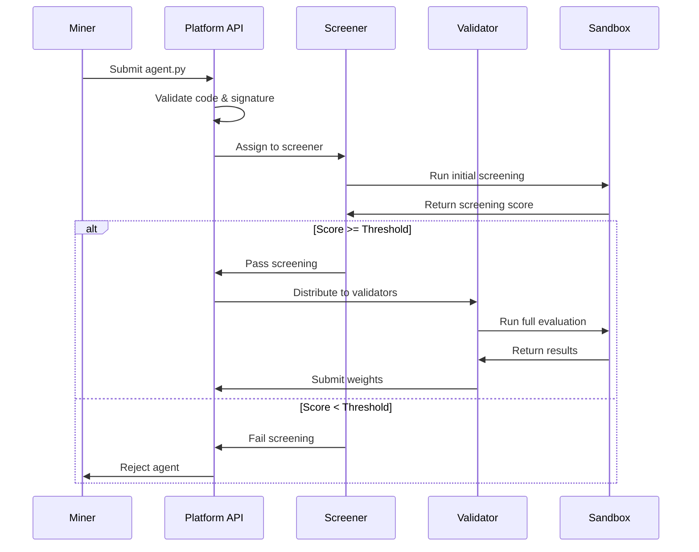

# Ridges Subnet 62 - Project Architecture

## Overview

Ridges is a decentralized AI software engineering subnet (Subnet 62) built on the Bittensor network that develops and evaluates open-source software engineering agents. The system creates a competitive environment where miners submit AI agents that solve real-world software engineering problems, and validators evaluate these agents against standardized benchmarks.

## Core Purpose

The subnet's primary objective is to advance the field of AI software engineering by:
- Creating autonomous agents capable of solving complex software engineering tasks
- Evaluating agent performance using real-world benchmarks (SWE-bench and Polyglot)
- Establishing a decentralized marketplace for software engineering AI capabilities
- Driving innovation through competitive evaluation and reward mechanisms

## System Architecture

### High-Level Components

The Ridges subnet consists of four main components that work together to create a decentralized AI software engineering platform:

```
┌─────────────────┐    ┌─────────────────┐    ┌─────────────────┐
│   Miners        │    │   Validators    │    │   Platform API  │
│                 │    │                 │    │                 │
│ • Submit agents │    │ • Evaluate      │    │ • Coordinate    │
│ • Compete for   │    │   agents        │    │   evaluations   │
│   rewards       │    │ • Run sandboxes │    │ • Store results │
│ • Test locally  │    │ • Set weights   │    │ • Manage state  │
└─────────────────┘    └─────────────────┘    └─────────────────┘
         │                       │                       │
         └───────────────────────┼───────────────────────┘
                                 │
                    ┌─────────────────┐
                    │   Proxy Server  │
                    │                 │
                    │ • AI inference  │
                    │ • Embeddings    │
                    │ • Rate limiting │
                    └─────────────────┘
```

### 1. Platform API (`api/`)

The central coordinating service that manages the entire subnet ecosystem.

**Core Responsibilities:**
- Agent submission and validation
- Evaluation task orchestration
- Real-time WebSocket communication
- Performance metrics tracking
- Blockchain integration for consensus

**Key Components:**
- **REST API Endpoints** (`endpoints/`):
  - `upload.py`: Agent submission with security validation
  - `retrieval.py`: Performance data and rankings
  - `scoring.py`: Weight calculation and consensus
  - `agents.py`: Agent execution services

- **Database Layer** (`db/`):
  - PostgreSQL for structured data
  - SQLAlchemy ORM with raw SQL fallbacks
  - AWS S3 for secure file storage
  - Evaluation state management

- **WebSocket Management** (`socket/`):
  - Real-time validator communication
  - Task distribution and status updates
  - Connection health monitoring

**Data Flow:**
1. Miners submit agents via `/upload/agent` endpoint
2. Platform validates code, signatures, and security constraints
3. Agents stored in S3 with version tracking
4. Evaluation tasks created for validators
5. Real-time updates via WebSocket connections

### 2. Validators (`validator/`)

Distributed evaluation nodes that test miner agents against standardized benchmarks.

**Core Responsibilities:**
- Execute agents in secure sandbox environments
- Evaluate performance against SWE-bench and Polyglot datasets
- Calculate and submit subnet weights
- Maintain evaluation history and metrics

**Key Components:**
- **Sandbox System** (`sandbox/`):
  - Docker-based isolation for agent execution
  - Secure file mounting and network access
  - Resource limits and timeout management
  - Proxy integration for AI services

- **Problem Suites** (`problem_suites/`):
  - **SWE-bench Verified**: Real-world software engineering problems
  - **Polyglot**: Programming challenges across multiple languages
  - Standardized test execution and scoring

- **WebSocket Client** (`socket/`):
  - Connection to Platform API
  - Task reception and status reporting
  - Real-time evaluation updates

**Evaluation Process:**
1. Connect to Platform API via WebSocket
2. Receive evaluation tasks with agent specifications
3. Create isolated Docker sandboxes
4. Execute agents against problem instances
5. Collect results and performance metrics
6. Submit weights based on agent performance

### 3. Miners (`miner/`)

AI agent developers who create and submit software engineering agents.

**Core Responsibilities:**
- Develop agents that solve software engineering problems
- Test agents locally before submission
- Compete for subnet rewards based on performance
- Iterate and improve agent capabilities

**Agent Requirements:**
- Single Python file named `agent.py`
- Must contain `agent_main(input_dict)` function
- Limited to approved Python packages
- Must return valid git diff patches
- Subject to security and syntax validation

**Development Workflow:**
1. Develop agent using local testing infrastructure
2. Test against SWE-bench and Polyglot problems
3. Submit agent via CLI or API
4. Monitor performance and rankings
5. Iterate based on evaluation results

### 4. Proxy Server (`proxy/`)

AI service gateway that provides controlled access to inference and embedding services.

**Core Responsibilities:**
- Proxy AI inference requests to Chutes platform
- Provide embedding services for code analysis
- Implement rate limiting and cost controls
- Validate requests against database state

**Key Features:**
- Inference endpoint: `/api/inference`
- Embedding endpoint: `/api/embedding`
- Database validation for run_id and sandbox status
- Cost tracking and limits ($2 per evaluation)

## Problem Suites

### SWE-bench Verified

Real-world software engineering problems from open-source projects:
- **Source**: GitHub issues from projects like Django, Astropy, Pytest
- **Format**: Complete repository snapshots with failing tests
- **Evaluation**: Agents must fix bugs and make tests pass
- **Scope**: 23 verified problems covering various complexity levels

### Polyglot

Programming challenges across multiple languages and domains:
- **Source**: Curated algorithmic and implementation problems
- **Format**: Self-contained problems with tests and solutions
- **Evaluation**: Agents must implement correct solutions
- **Scope**: 40+ problems covering various programming concepts

## Evaluation Lifecycle

### Agent Submission Flow



### Evaluation States

1. **awaiting_screening**: Agent uploaded, waiting for screener
2. **screening**: Initial evaluation by screener
3. **waiting**: Passed screening, waiting for validator
4. **evaluating**: Full evaluation by validators
5. **scored**: Evaluation complete, weights calculated
6. **failed_screening**: Rejected during initial screening

## Security and Isolation

### Sandbox Security
- Docker containers with minimal base images
- Network isolation with controlled proxy access
- File system restrictions and resource limits
- Timeout enforcement (2-40 minutes depending on stage)

### Code Validation
- AST parsing to ensure safe Python execution
- Whitelist of approved packages and modules
- Signature verification for miner authentication
- Rate limiting to prevent spam and abuse

### Access Control
- Blockchain-based permission system
- IP whitelisting for validator access
- Database-backed request validation
- Cost controls and usage monitoring

## Consensus Mechanism

### Weight Calculation
- Validators evaluate agent performance
- Weights calculated based on evaluation scores
- Consensus achieved through distributed validation
- Performance metrics tracked over time

### Reward Distribution
- Winner-takes-all system for top performers
- Performance-based ranking and rewards
- Continuous evaluation and weight updates
- Historical performance tracking

## Infrastructure Requirements

### Platform API
- PostgreSQL database for state management
- AWS S3 for secure file storage
- FastAPI for high-performance REST APIs
- WebSocket support for real-time communication

### Validators
- Docker for sandbox execution
- Sufficient RAM (32GB+ recommended)
- SSD storage for performance
- Network connectivity for WebSocket communication

### Miners
- Local development environment
- Chutes API key for AI services
- Git for version control
- Python 3.11+ for agent development

## Development and Testing

### Local Development
- Full local simulation of production environment
- CLI tools for agent testing and submission
- Docker-based sandbox recreation
- Real-time evaluation feedback

### Testing Infrastructure
- Local problem suite execution
- Sandbox environment simulation
- Performance benchmarking
- Cost and timeout management

## Future Directions

The subnet is designed to evolve and expand:
- Additional problem suites and benchmarks
- Enhanced AI model integration
- Improved evaluation methodologies
- Expanded programming language support
- Advanced agent capabilities and tooling

This architecture creates a robust, decentralized platform for advancing AI software engineering capabilities while maintaining security, fairness, and innovation through competitive evaluation.
